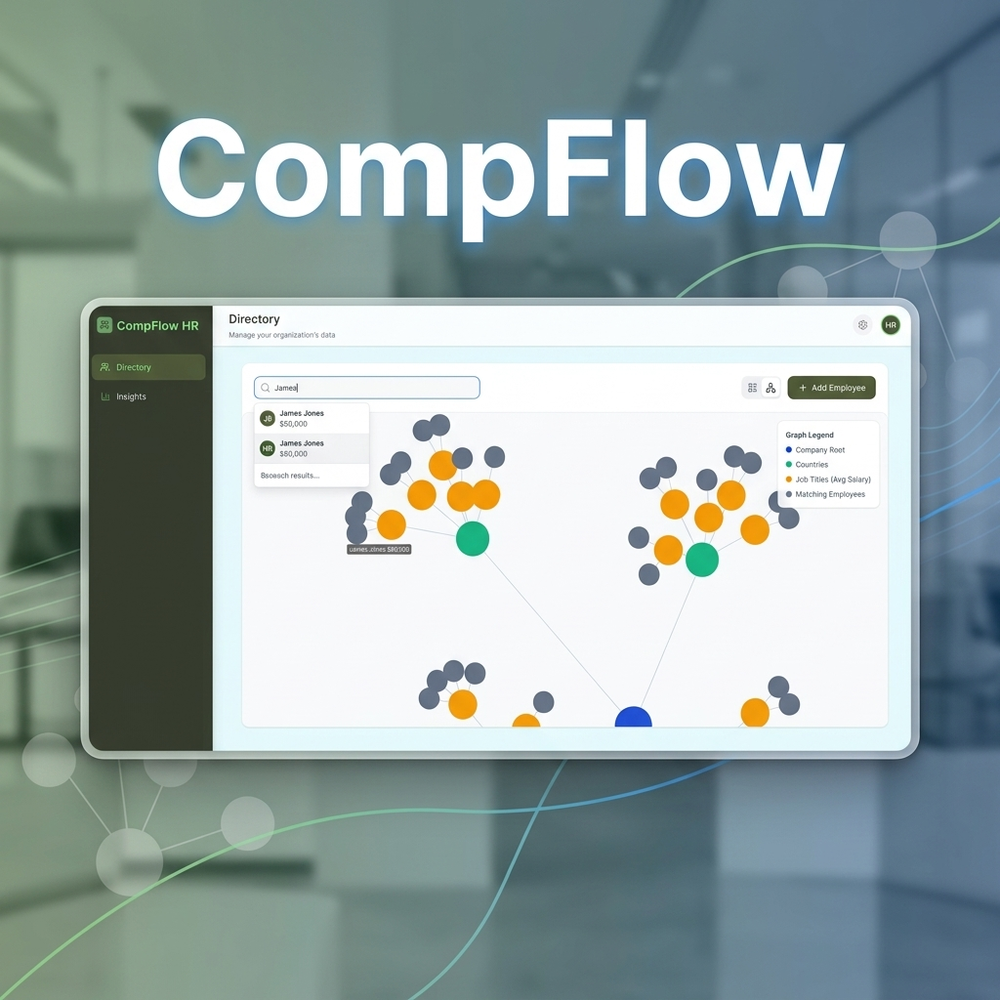

<div align="center">
  
  
  <h1>CompFlow 🚀</h1>
  <p><b>HR Analytics & Organizational Intelligence Platform</b></p>
</div>

CompFlow is a high-performance, modern salary management and compensation intelligence platform designed for organizations with up to 10,000+ employees. Built with an elite developer workflow focusing on Test-Driven Development (TDD) and clean software craftsmanship principles.

---

## 🏗️ Architecture & Tech Stack

CompFlow is designed as a clean full-stack monorepo:
* **`/server`**: An Express.js backend powered by TypeScript, SQLite, and Prisma ORM, utilizing Jest for strict unit and integration testing.
* **`/client`**: A high-fidelity React.js frontend powered by Vite, Zustand, and styled with Tailwind CSS v4, delivering a premium, real-time analytics dashboard and an interactive HTML5 force-directed Organizational Canvas graph.

---

## 🚀 Getting Started (Step-by-Step Guide)

Follow these exact steps to set up and run the entire full-stack application locally. **Do not skip any steps.**

### Step 1: Setup the Backend Server
Open a terminal window and navigate to the root folder of the project.
```bash
# Navigate to the server directory
cd server

# Install backend dependencies
npm install

# Setup environment variables
cp .env.example .env

# Run Database Seeding (Creates SQLite dev.db and seeds exactly 10,000 employees)
npm run seed

# Run the backend test suite (Verifies API logic in an isolated test.db)
npm test

# Start the development server (Runs on port 3000)
npm run dev
```

### Step 2: Setup the Frontend Client
Leave the server terminal running, and open a **second** terminal window.
```bash
# Ensure you are in the root project folder, then navigate to the client directory
cd client

# Install frontend dependencies
npm install

# Run frontend test suite (Vitest + React Testing Library)
npm run test

# Start the Vite development server
npm run dev
```

### Step 3: View the Application
Once both servers are running, open your web browser and navigate to the frontend URL (usually port 5173 or 3001 depending on your Vite setup):
👉 **[http://localhost:5173](http://localhost:5173)**

---

## 📖 Interactive API Testing (Swagger UI)

CompFlow ships with full interactive API documentation. You can test and verify all CRUD and health-check endpoints manually on the backend server.

👉 **Swagger URL:** [http://localhost:3000/api-docs](http://localhost:3000/api-docs)

---
*Designed and developed with software craftsmanship by Prashant Kumar.*
