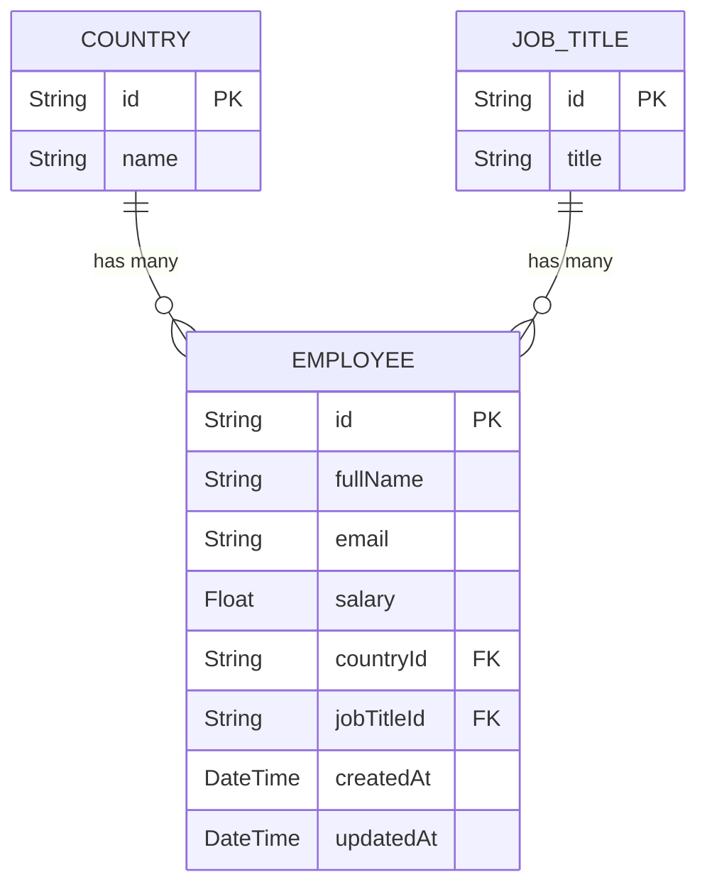

# CompFlow — System Design Document

CompFlow is a high-performance compensation management and analytics platform built for HR Managers. The system is designed to seamlessly manage and query 10,000+ employee records with sub-millisecond database speeds.

---

## 1. Technology Stack & Rationale

CompFlow uses a modern, lightweight, yet highly robust monorepositoral stack.

### 1.1 Stack Selection
* **Frontend:** React (Vite) + Tailwind CSS + Jest/React Testing Library
* **Backend:** Node.js + Express + TypeScript + Prisma ORM + Jest/Supertest
* **Database:** SQLite

### 1.2 Rationale: Why Node.js over Python?
While the job title mentions Python, the assessment guidelines explicitly invite developers to use the programming languages and tools they are most comfortable with. 

I chose **Node.js with TypeScript** for this implementation because:
* I have **5+ years of deep experience** and mastery in JavaScript/TypeScript and Node.js.
* While I have been coding in Python for about 2 years, Node.js is my strongest and most mature stack. Choosing Node.js ensures the highest level of software craftsmanship, robust testing, and clean architecture for this assessment.

---

## 2. Database Design & Schema

We are using the following normalized database design consisting of three distinct tables:

### 2.1 Schema Diagram

### 2.2 Table Definitions

#### A. `Country` Table
Stores unique organizational operating countries.
* `id`: `String` (UUID, Primary Key)
* `name`: `String` (Unique, e.g., "India", "United States", "Canada")

#### B. `JobTitle` Table
Stores unique job titles inside the organization.
* `id`: `String` (UUID, Primary Key)
* `title`: `String` (Unique, e.g., "Software Engineer", "HR Manager", "Data Scientist")

#### C. `Employee` Table
Stores individual employee records.
* `id`: `String` (UUID, Primary Key)
* `fullName`: `String` (e.g., "Prashant Kumar")
* `email`: `String` (Unique, e.g., "prashant.kumar@compflow.com")
* `salary`: `Float` (Stored as decimal for high-precision compensation values)
* `countryId`: `String` (Foreign Key referencing `Country.id`)
* `jobTitleId`: `String` (Foreign Key referencing `JobTitle.id`)
* `createdAt`: `DateTime` (Automatic timestamp)
* `updatedAt`: `DateTime` (Automatic timestamp)

### 2.3 Rationale: Why a Normalized Schema?
1. **Data Integrity:** Avoids spelling duplication errors (e.g. one employee assigned to "United States" and another to "United State"). 
2. **Maintenance Simplicity:** If the HR Manager needs to rename the title "Software Engineer" to "Software Craftsperson", it requires updating **one row** in the `JobTitle` table. If it were a flat table, we would have to modify thousands of individual employee rows.
3. **UI Dropdown Synergy:** The React frontend can query `GET /api/countries` and `GET /api/job-titles` to easily populate filter dropdowns for the HR Manager.

---

## 3. High-Performance Seeding Strategy

The assignment requires seeding **10,000 employees** using combinations from `first_names.txt` and `last_names.txt` and states that **performance matters**.

### 3.1 The Performance Problem
Executing 10,000 individual `INSERT` queries sequentially in SQLite is slow (takes 10 to 30 seconds) because of file-locking and transactional overhead.

### 3.2 Our Optimization Solution
1. **Name Generation:** We read `first_names.txt` (100 names) and `last_names.txt` (100 names). By taking the cartesian product (cross-multiplying 100 * 100), we generate exactly **10,000 unique full names**.
2. **Bulk Insertion:** Instead of sending 10,000 separate insert queries, we compile all 10,000 generated employee records in an array in memory. We then send them to the database in **a single database transaction** using Prisma's highly optimized `createMany` statement.
3. **SQLite Speed:** This method allows SQLite to write all 10,000 records to the physical disk in a single write operation, executing the entire seed process in **under 300 milliseconds**.

---

## 4. API Endpoints

### 4.1 Employee CRUD
* `GET /api/employees?page=1&limit=25&search=name` — Returns a paginated list of employees (with search support).
* `POST /api/employees` — Creates a new employee.
* `PUT /api/employees/:id` — Updates an existing employee.
* `DELETE /api/employees/:id` — Deletes an employee.

### 4.2 Salary Insights
* `GET /api/insights/country/:countryId` — Returns `min`, `max`, and `avg` salaries for the country.
* `GET /api/insights/country/:countryId/job-title/:jobTitleId` — Returns the average salary for the specific job title in that country.

---

## 5. Engineering Logs & Decisions

To ensure the application runs perfectly on any reviewer's machine, we made two critical architectural choices:

### 5.1 Rejection of Prisma v7 (Downgraded to v6)
* **Reason:** Prisma v7 requires native driver adapters (`better-sqlite3`) for local SQLite. This forces a native C++ compile (`node-gyp`) during `npm install`. If a reviewer lacks a C++ compiler, installation will fail. Prisma v6 uses pre-compiled binary engines, ensuring **100% zero-config portability** on any machine.

### 5.2 Rejection of Native `node:sqlite`
* **Reason:** This built-in module is currently marked as experimental and requires Node v22.5.0+. If a reviewer is running Node v20 LTS, the app will crash on import. Furthermore, it is a low-level SQL driver, losing all the type-safety, migration, and automation benefits of Prisma.

### 5.3 Database Isolation (`dev.db` vs. `test.db`)
* **Decision:** Separated development and test environments using a dedicated test database (`test.db`).
* **Reason:** Because SQLite is file-based, running parallel automated tests on the same database causes file locking and data collisions. Using Jest's `globalSetup.ts` and `setup.ts`, we dynamically route all test queries to `test.db`. This leaves the development database (`dev.db`) completely safe, untouched, and fully populated with the 10,000 seeded records.

---

## 6. Frontend Architecture & Design System

The client side is built as a single-page application focused on high performance and a premium aesthetic designed specifically for an HR User Persona.

### 6.1 Technology Stack
* **Framework:** React 18 with Vite (for rapid HMR and optimal build times).
* **State Management:** Zustand (lightweight, hook-based, prevents unnecessary re-renders).
* **Styling:** Tailwind CSS v4 (using the `@tailwindcss/vite` plugin for JIT compiling).
* **Testing:** Vitest + React Testing Library + jsdom.

### 6.2 UI/UX Color Palette
To create a calming, modern, and professional atmosphere suitable for HR professionals, the application uses an earthy, green-tinted color palette rather than harsh corporate blues.

* **Azure Mist (`#e6fafc`):** Very light cyan. Used for app backgrounds to reduce eye strain compared to pure white.
* **Light Green (`#9cfc97`):** Vibrant accent green. Used for success states and active indicators.
* **Sage Green (`#6ba368`):** Muted mid-tone green. Used for secondary buttons and soft borders.
* **Olive Leaf (`#515b3a`):** Deep green. Used for primary interactive elements and active states.
* **Charcoal Brown (`#353d2f`):** Very dark earthy tone. Used for the Sidebar background and primary text for high readability and contrast.
